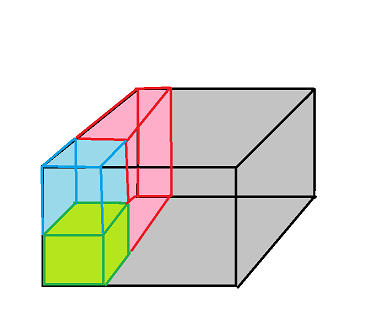
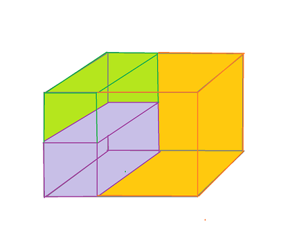

#Package App  
####By: Emmanuel Rosales, Ernesto Lang, Miuyin Yong 
 

##Introduction 

Package App is an application used to organize deliveries. Basically how it works it that the user can register the amount of trucks they have with the corresponding sizes. The clients information such as address and time availablity will also be entered. Last but not least the packages to be delivered have to be registered with their dimensions. Given all the necesary data the application organizes the packages in the trucks where they best fit. That means that the packages put into the trucks where there is a certainty that all the packages will fit in that particular truck and that the packages clients time availability won't interfere. 
  

##Strategy 
This problem is named the bin packing problem which has a NP-hard computational complexity which mean that it is so complex that there hasn't been an optimal solution found. In this application, the problem is solved but it is not optimal. 

To solve this proble there were various type of algorithms used.  

* The first and main algorithm that was used was a genetic algorithm. Basically every individual is a set of packages that have to be delivered. So, there is going to be a list the size of the amount of packages and every package is going to be represented by either a 1 or a 0. If it has a 1 it means that it will be delivered and 0 means that it won't. There is also a population which is composed of a set of individuals. The reason to create populations is to have more options from where to choose the individual with the best fitness and later on compare it to the best of another population. The goal is to have as many delivered as possible and stop when all the individuals in the population are represented by 1s. But since it is not always possible to deliver all of the packages the algorithm stops at the 20th population and takes the the individual of the population with the highest fitness (the most 1s).  

* The next algorithm used before calculating the fitness was greedy algorithm to check whether or not the available times of the packages owners clash. To do so, the methodology was basically to always take the first packages time availability and check if the next packages time would start before or after the finishing time of the last package. If it starts before the last package ends then that package can not be chosen and moves on to the next possible package and so on... until all the packages have been considered. 

* The last algorithm used in this problem is the backtracking algorithm which is implemented in the calculation of the individuals fitness. As mentioned above, the fitness is measured by the amount of packaged that can be delivered. To calculate wether or not it can be delivered after having checked the time clash, the space that the packages take in the truck has to be precisely worked out. So, the logic behind ths problem was to take the trucks space and divide it in subspaces. The first package would always be inserted in the left end of the truck and there would be three other subspaces created. One subspace would be above, one on the right handside and one in front of the package inserted. After creating these subspaces the next packages would be tested to see if they fit in any of the subspaces. If they don't fit in one they will try with the next (which is why backtracking was used). If it fits then the subspace would be set as full and this process would start all over again. But if there is at least one package that does not fit in any subspace then the fitness would be 0. 

Here are some visual examples of the logic behind the backtracking algorithm: 

    
  

	In this first example, the first package is the green box. Here it is very clear that there are three other subspaces. The one on top is the blue box which has the same length and width but a different height. The right subspace is the red one and the one if front is the grey one.
	

 

	In this second example, the first package is the purple one. Here, it is not clear that there are three other subspaces right? there are only two. There's the green one which is the one above and theone in front that's in orange. The right subspace is calculated but since the first purple package is the same width as the truck, there isn't a right subspace. 

